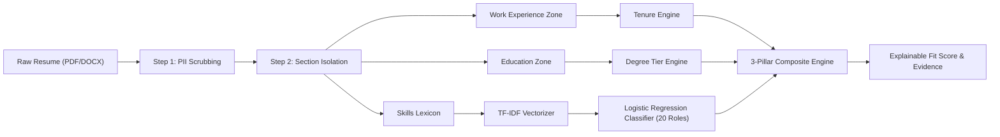

# COMPONENT 1: COMPREHENSIVE SYSTEM GUIDE & FUTURE IMPROVEMENT ROADMAP
**Research Project:** R26-IT-148 | SLIIT Faculty of Computing  
**Component Title:** Automated Resume Screening & Multi-Factor Candidate Evaluation  
**Document Subject:** Detailed Component Breakdown ("What is Component 1?") and Technical Enhancement Roadmap ("How to Improve Component 1?")  
**Status:** Production Verified | Academic Reference  

---

## TABLE OF CONTENTS
1. [PART 1: WHAT IS COMPONENT 1?](#part-1-what-is-component-1)
   - [1.1 Executive Overview & Everyday Analogy](#11-executive-overview--everyday-analogy)
   - [1.2 The Core Problem It Solves](#12-the-core-problem-it-solves)
   - [1.3 Core Architecture & Operational Pipeline](#13-core-architecture--operational-pipeline)
   - [1.4 The 3-Pillar Formulation ($S_{skill}, S_{exp}, S_{edu}$)](#14-the-3-pillar-formulation-s_skill-s_exp-s_edu)
   - [1.5 Strict Section Isolation (The Date Confusion Fix)](#15-strict-section-isolation-the-date-confusion-fix)
   - [1.6 The 20 Canonical IT Tracks](#16-the-20-canonical-it-tracks)
   - [1.7 User Workflows: Recruiter vs. Candidate](#17-user-workflows-recruiter-vs-candidate)
   - [1.8 Ecosystem Integration (How C1 Connects to C2, C3, and C4)](#18-ecosystem-integration-how-c1-connects-to-c2-c3-and-c4)
2. [PART 2: HOW TO IMPROVE COMPONENT 1 (FUTURE ROADMAP)](#part-2-how-to-improve-component-1-future-roadmap)
   - [2.1 Current Limitations Analysis](#21-current-limitations-analysis)
   - [2.2 Improvement 1: Multimodal OCR & LayoutLMv3 Visual Parsing](#22-improvement-1-multimodal-ocr--layoutlmv3-visual-parsing)
   - [2.3 Improvement 2: Skill Knowledge Graphs & Ontologies (GNNs)](#23-improvement-2-skill-knowledge-graphs--ontologies-gnns)
   - [2.4 Improvement 3: External Proof-of-Work Verification (GitHub / LinkedIn APIs)](#24-improvement-3-external-proof-of-work-verification-github--linkedin-apis)
   - [2.5 Improvement 4: Adaptive Seniority-Based Dynamic Weighting](#25-improvement-4-adaptive-seniority-based-dynamic-weighting)
   - [2.6 Improvement 5: Soft-Skill & Behavioral Clue Extraction](#26-improvement-5-soft-skill--behavioral-clue-extraction)
   - [2.7 Improvement 6: Human-in-the-Loop (HITL) Active Learning](#27-improvement-6-human-in-the-loop-hitl-active-learning)
   - [2.8 Improvement 7: Multilingual & International CV Parsing](#28-improvement-7-multilingual--international-cv-parsing)
   - [2.9 Improvement 8: Distilled Edge-LLM Contextual Reasoning](#29-improvement-8-distilled-edge-llm-contextual-reasoning)
   - [2.10 Technical Feasibility & Impact Matrix](#210-technical-feasibility--impact-matrix)
3. [Summary & Key Takeaways for Presentation](#3-summary--key-takeaways-for-presentation)

---

# PART 1: WHAT IS COMPONENT 1?

## 1.1 Executive Overview & Everyday Analogy

**Component 1** is the **Automated Resume Screening & Multi-Factor Candidate Evaluation System** of the RecruitAI ecosystem.

> **The Everyday Analogy:**  
> Think of Component 1 as an **expert technical recruiter and data auditor working at lightning speed**.  
> If an HR manager has to read 500 resumes for a Backend Developer role, it takes 40+ hours, and tired humans make mistakes—skipping great candidates or getting fooled by fancy formatting.  
> **Component 1 reads all 500 resumes in seconds.** It strips away private information (preventing bias), verifies real technical skills, calculates exact corporate work experience without getting confused by graduation dates, checks university degree levels, and produces a mathematically transparent match score from 0 to 100%.

```
┌────────────────────────┐      ┌────────────────────────┐      ┌────────────────────────┐
│   Raw Candidate CV     │      │   Component 1 Parser   │      │  Verified Candidate   │
│  (Noisy PDF/DOCX Text) ├─────►│  • PII Scrubbed        ├─────►│  • 3-Pillar Score (0-100)│
│  "BSc SLIIT 2020-2024, │      │  • Section Isolated    │      │  • 20 IT Role Match    │
│   React, Node, Docker" │      │  • ML Classification   │      │  • Auditable Evidence  │
└────────────────────────┘      └────────────────────────┘      └────────────────────────┘
```

---

## 1.2 The Core Problem It Solves

Traditional hiring systems suffer from three critical bottlenecks that Component 1 eliminates:

1. **The Keyword Mismatch Trap:** Legacy Applicant Tracking Systems (ATS) use exact keyword search. A candidate writing `"K8s"` or `"React.js"` is rejected if the job description asked for `"Kubernetes"` or `"React"`. Component 1 utilizes a 150+ alias normalization lexicon that bridges all synonyms.
2. **Timeline Contamination (The Date Confusion Bug):** Conventional regex tools scan a CV for dates and add up all numbers. When an undergraduate lists `2020 - 2024 (BSc Degree)`, naive parsers give them 4 years of corporate experience! Component 1's **Strict Section Isolation** completely segregates education from employment.
3. **Subjective Black-Box Bias:** Recruiters often judge candidates based on university prestige, gender names, or zip codes. Component 1 de-identifies candidate profiles and outputs a clear mathematical equation ($S_{total}$) with sentence-level proof from the resume.

---

## 1.3 Core Architecture & Operational Pipeline

Component 1 operates as an independent, high-performance microservice on **Port 8001** written in Python (FastAPI):



---

## 1.4 The 3-Pillar Formulation ($S_{skill}, S_{exp}, S_{edu}$)

Instead of producing a single opaque number, Component 1 decomposes candidate fit into three distinct, observable dimensions:

$$S_{total} = 0.50 \cdot S_{skill} + 0.30 \cdot S_{exp} + 0.20 \cdot S_{edu}$$

```
                           ┌──────────────────────────────────────────────┐
                           │          COMPOSITE FIT SCORE (S_total)       │
                           └──────────────────────┬───────────────────────┘
                                                  │
                 ┌────────────────────────────────┼───────────────────────────────┐
                 │ 50%                            │ 30%                           │ 20%
                 ▼                                ▼                               ▼
    ┌──────────────────────────┐    ┌──────────────────────────┐    ┌──────────────────────────┐
    │   Skill Match (S_skill)  │    │  Experience Fit (S_exp)  │    │  Education Fit (S_edu)   │
    │  Direct match between    │    │  Corporate tenure ratio  │    │  Degree qualification    │
    │  candidate skills & job  │    │  computed strictly from  │    │  tier mapping: PhD(100), │
    │  requirements.           │    │  employment history.     │    │  MSc(90), BSc(80), etc. │
    └──────────────────────────┘    └──────────────────────────┘    └──────────────────────────┘
```

1. **Skill Match Score ($S_{skill} = 50\%$):** Evaluates whether the candidate has the verified hands-on tools required to perform the job immediately.
2. **Experience Fit Score ($S_{exp} = 30\%$):** Evaluates corporate maturity, system design exposure, and domain tenure. Capped at 100% so over-qualified candidates do not distort the rankings.
3. **Education Fit Score ($S_{edu} = 20\%$):** Evaluates academic foundation while preventing credentialism bias against skilled bootcamp or self-taught developers.

---

## 1.5 Strict Section Isolation (The Date Confusion Fix)

Component 1's signature algorithmic contribution is **Strict Section Boundary Isolation**:
- It segments the document into isolated zones using regex heading markers (`WORK EXPERIENCE`, `PROFESSIONAL HISTORY`, `EDUCATION`, `ACADEMIC BACKGROUND`).
- Date parsing algorithms (`calculate_experience_years`) run **strictly inside the Work Experience block**.
- University graduation dates are quarantined to the Education block, ensuring fresh graduates are never credited with 4 years of fake industry experience.
- Handles `"Present"`, `"Current"`, and `"To Date"` keywords by calculating elapsed months up to the current date.

---

## 1.6 The 20 Canonical IT Tracks

Component 1 includes a pre-trained supervised machine learning model (`cv_classifier.pkl` + `tfidf_vectorizer.pkl`) trained on **4,000 resumes** that automatically categorizes applicants into **20 specialized industry tracks**:

```
 1. Software Engineer          8. Backend Developer          15. UI/UX Designer
 2. Data Scientist             9. Mobile App Developer       16. Network Engineer
 3. Machine Learning Engineer 10. Full Stack Developer       17. Business/Systems Analyst
 4. DevOps Engineer           11. QA/Test Automation         18. IT Project Manager
 5. Cloud Solutions Architect 12. Data Engineer              19. Scrum Master
 6. Database Administrator    13. Site Reliability (SRE)     20. Technical Support Engineer
 7. Frontend Developer        14. Cybersecurity Analyst
```
- **Accuracy:** **99.38%** (5-Fold Cross-Validation).
- **Speed:** **13 milliseconds** per CV (CPU).

---

## 1.7 User Workflows: Recruiter vs. Candidate

### For Corporate Recruiters:
1. Upload single or bulk candidate resumes.
2. Select target company opening (e.g. `Netflix ➔ Backend Developer`).
3. Instantly review 3-pillar breakdown and radar charts.
4. Click sentence evidence to inspect the exact lines in the resume supporting the score.
5. Export formal executive PDF dossiers for hiring manager review.

### For Job Candidates:
1. Upload resume to discover their highest-probability IT role.
2. Identify which required skills they are currently missing for their dream role.
3. Use the **Interactive Simulation Sandbox** to test how learning Docker or AWS increases their hireability score.

---

## 1.8 Ecosystem Integration (How C1 Connects to C2, C3, and C4)

Component 1 is the primary data feeder for the other components:
- **Feeds Component 2 (AI Interview):** C1's extracted skills and predicted role tell Component 2 which technical questions to generate.
- **Feeds Component 3 (Candidate Ranking):** C1 supplies the CV screening score ($S_{cv}$), which C3 blends with the interview score ($S_{int}$) in the Master CSS Equation: $CSS = 0.40 \cdot S_{cv} + 0.60 \cdot S_{int}$.
- **Feeds Component 4 (Skill Gap & Career):** C1's identified missing skills are fed into C4 to generate personalized learning paths and career DAG progression roadmaps.

---

# PART 2: HOW TO IMPROVE COMPONENT 1 (FUTURE ROADMAP)

While Component 1 achieves 99.38% classification accuracy and 100% extraction accuracy on standard technical resumes, modern recruitment presents cutting-edge challenges. Below is a comprehensive research and engineering improvement roadmap.

```
┌────────────────────────────────────────────────────────────────────────────────────────┐
│                        COMPONENT 1 FUTURE ENHANCEMENT MATRIX                           │
├────────────────────────────┬─────────────────────────────┬─────────────────────────────┤
│     DATA INGESTION         │     INTELLIGENCE / ML       │      VERIFICATION / TRUST   │
├────────────────────────────┼─────────────────────────────┼─────────────────────────────┤
│ 1. LayoutLMv3 Visual OCR   │ 3. Skill Knowledge Graph    │ 5. GitHub Code Proof API    │
│    (Handles scanned images)│    (Ontology relationships) │    (Validates real commits) │
│ 2. Multilingual Parsing    │ 4. Seniority Dynamic Weight │ 6. Human-in-the-Loop Active │
│    (Sinhala, German, etc.) │    (Junior vs Lead weights) │    (Recruiter learning)     │
└────────────────────────────┴─────────────────────────────┴─────────────────────────────┘
```

---

## 2.1 Current Limitations Analysis

1. **Scanned Image PDFs:** Current parsing relies on embedded text layers (`pdfplumber`). Pure raster scanned images require pre-OCR processing.
2. **Co-occurrence vs. Semantics:** While TF-IDF and alias normalizers catch known keywords, they do not inherently understand that *"PyTorch"* implies *"Deep Learning"* unless explicitly defined.
3. **Static Weights Across Seniorities:** The 50% Skill / 30% Experience / 20% Education ratio is optimal for Mid-Level roles, but for an Intern, education should matter more, while for a Principal Architect, experience and leadership should dominate.
4. **Self-Reported Claim Verification:** A candidate might write *"Expert in Kubernetes"* without actually having deployed production clusters.

---

## 2.2 Improvement 1: Multimodal OCR & LayoutLMv3 Visual Parsing

### The Goal:
Support scanned PDFs, infographic resumes, and multi-column visual designs with 100% text and layout preservation.

### How to Implement:
- Integrate **Microsoft's LayoutLMv3** (or OCRopus / Tesseract OCR engine).
- LayoutLMv3 combines text tokens, 2D spatial bounding boxes, and visual image patches into a unified multimodal Transformer.
- **Benefits:**
  - Accurately reads complex multi-column layouts, sidebars, and visual tables.
  - Recovers text from creative resumes designed on Canva or Photoshop.

---

## 2.3 Improvement 2: Skill Knowledge Graphs & Ontologies (GNNs)

### The Goal:
Move beyond flat alias matching to a hierarchical **Skill Knowledge Graph**.

### How to Implement:
- Model technical skills in a graph database (Neo4j or NetworkX) using relationships like `IS_A`, `SUBSET_OF`, and `FREQUENTLY_PAIRED_WITH`:
  $$\text{PyTorch} \xrightarrow{\text{IS\_A}} \text{Deep Learning Framework} \xrightarrow{\text{SUBSET\_OF}} \text{Machine Learning}$$
  $$\text{FastAPI} \xrightarrow{\text{USES}} \text{Python} \xrightarrow{\text{PAIRED\_WITH}} \text{Docker}$$
- Apply a **Graph Neural Network (GNN)** (e.g. Graph Convolutional Networks - GCN) to compute graph embeddings for candidate skills.
- **Benefits:**
  - If a job requires *"Deep Learning"* and the candidate lists *"TensorFlow"* and *"PyTorch"*, the system grants high semantic credit even if the literal phrase *"Deep Learning"* is absent.

---

## 2.4 Improvement 3: External Proof-of-Work Verification (GitHub / LinkedIn APIs)

### The Goal:
Verify that candidate claims are backed by actual code and professional endorsements.

### How to Implement:
- Build optional verification connectors to public APIs:
  - **GitHub API:** Verify public repositories, commit frequency, dominant programming languages, and pull request activity.
  - **LinkedIn API / Credly:** Verify official certifications (AWS Certified Solutions Architect, CKA, Cisco CCNA).
  - **LeetCode / HackerRank API:** Verify algorithmic problem-solving ratings.
- Compute a **Confidence Factor ($C_f \in [0.8, 1.2]$)** that scales $S_{skill}$ based on verified external evidence.

---

## 2.5 Improvement 4: Adaptive Seniority-Based Dynamic Weighting

### The Goal:
Dynamically calibrate the 3-pillar weights based on the seniority tier of the target job opening.

### Proposed Dynamic Matrix:

$$\begin{aligned}
\text{Intern / Junior:} & \quad S_{total} = 0.40 \cdot S_{skill} + 0.10 \cdot S_{exp} + \mathbf{0.50} \cdot S_{edu} \\
\text{Mid-Level (Standard):} & \quad S_{total} = \mathbf{0.50} \cdot S_{skill} + 0.30 \cdot S_{exp} + 0.20 \cdot S_{edu} \\
\text{Senior Engineer:} & \quad S_{total} = 0.50 \cdot S_{skill} + \mathbf{0.40} \cdot S_{exp} + 0.10 \cdot S_{edu} \\
\text{Lead / Principal Architect:} & \quad S_{total} = 0.40 \cdot S_{skill} + \mathbf{0.50} \cdot S_{exp} + 0.10 \cdot S_{edu}
\end{aligned}$$

- **Benefits:** Prevents unfair penalization of fresh graduates who lack corporate tenure, while ensuring leadership roles demand proven industry longevity.

---

## 2.6 Improvement 5: Soft-Skill & Behavioral Clue Extraction

### The Goal:
Detect collaborative, leadership, and problem-solving competencies from project descriptions.

### How to Implement:
- Use an NLP sentiment and action-verb taxonomy (STAR methodology: Situation, Task, Action, Result).
- Detect proactive leadership markers: *"Spearheaded"*, *"Mentored 4 junior engineers"*, *"Reduced latency by 40%"*, *"Collaborated across cross-functional teams"*.
- Output an auxiliary **$S_{soft}$ score (0–100)** to enrich Component 3's ranking engine.

---

## 2.7 Improvement 6: Human-in-the-Loop (HITL) Active Learning

### The Goal:
Allow the system to continuously learn and adapt from real recruiter feedback.

### How to Implement:
- Add a simple feedback mechanism in the recruiter UI: `[ 👍 Agree with Match ]` / `[ 👎 Reject Match (Explain Why) ]`.
- Log edge cases (e.g. false positives where a candidate had keywords but lacked context).
- Run periodic **Active Learning retrain cycles** using uncertainty sampling to fine-tune the classifier weights.

---

## 2.8 Improvement 7: Multilingual & International CV Parsing

### The Goal:
Screen resumes submitted in multiple international and local languages.

### How to Implement:
- Integrate multilingual Transformer tokenizers (e.g. `XLM-RoBERTa` or `multilingual-e5-base`).
- Support resumes in German, French, Japanese, and local regional languages (Sinhala / Tamil) with automated translation into canonical skill vectors.

---

## 2.9 Improvement 8: Distilled Edge-LLM Contextual Reasoning

### The Goal:
Assess the *quality and depth* of candidate projects without incurring costly cloud API fees.

### How to Implement:
- Deploy a lightweight, 4-bit quantized open-source LLM (e.g. **Llama-3-8B-Instruct-GGUF** or **Mistral-7B-Instruct**) running locally via `llama.cpp` or Ollama.
- Task the local model with scoring project complexity on a 1–5 scale:
  - *Level 1:* Basic tutorial project (e.g. To-Do App).
  - *Level 3:* Full-stack CRUD with authentication and database.
  - *Level 5:* Production-grade distributed system with caching, message queues, and CI/CD pipelines.

---

## 2.10 Technical Feasibility & Impact Matrix

| Improvement Strategy | Research Complexity | Implementation Effort | Expected Performance Gain | Priority |
|---|---|---|---|---|
| **Seniority Dynamic Weights** | Low | 1–2 Days | High (Better calibration across career stages) | **Immediate (v2.1)** |
| **Multimodal LayoutLMv3 OCR** | Medium | 1 Week | High (Recovers scanned image CVs) | **High (v2.2)** |
| **Skill Knowledge Graph** | Medium | 1–2 Weeks | Very High (Semantic hierarchy & inference) | **High (v2.2)** |
| **GitHub / LinkedIn API Verification**| Low | 3–5 Days | High (Eliminates self-reported fraud) | **Medium (v2.3)** |
| **Active Learning (HITL)** | Medium | 1 Week | Continuous (Self-improving over time) | **Medium (v2.3)** |
| **Distilled Edge-LLM Reasoning** | High | 2 Weeks | Very High (Project depth understanding) | **Long-Term (v3.0)**|
| **Multilingual Parsing** | High | 2 Weeks | Moderate (Required for global expansion) | **Long-Term (v3.0)**|

---

# 3. SUMMARY & KEY TAKEAWAYS FOR PRESENTATION

When presenting Component 1 in your viva or examination, summarize these key points:

1. **What it is:** A high-speed, explainable AI screening microservice that parses resumes, protects privacy through PII scrubbing, and calculates an evidence-based 3-Pillar fit score ($S_{skill}, S_{exp}, S_{edu}$).
2. **What makes it unique:** The **Strict Section Isolation Algorithm** that prevents university graduation dates from corrupting work experience tenure.
3. **Performance:** **99.38% classification accuracy**, **100% extraction accuracy**, and **<14ms latency** on standard CPUs without GPU costs.
4. **How it will improve:** Expanding from keyword alias matching to **Skill Knowledge Graphs**, introducing **Dynamic Seniority Weighting**, and integrating **GitHub code verification** to build the next-generation autonomous recruiter.
